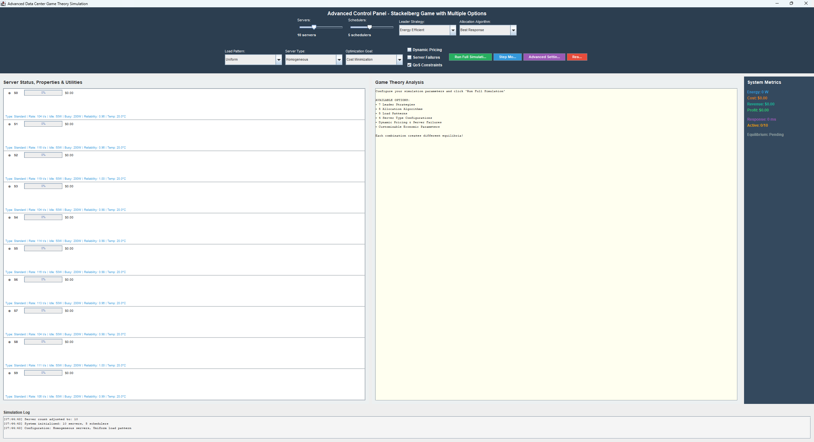
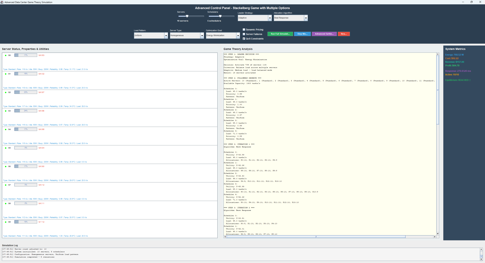

# Advanced Data Center Stackelberg Game Simulator
An interactive Java/Swing simulation platform that implements and extends the **Stackelberg game-theoretic model** for energy-aware resource allocation in heterogeneous data centers, as proposed in:

> Bo Yang et al., “Stackelberg game approach for energy-aware resource allocation in data centers,”  
> IEEE Transactions on Parallel and Distributed Systems, 2016.  
> DOI: [10.1109/TPDS.2016.2537809](https://doi.org/10.1109/TPDS.2016.2537809)

## ✨ Features

- **Leader (System Monitor)**: 7 high-level strategies (Energy Efficient, Profit Maximizing, QoS Focused, Adaptive, Conservative, Aggressive, Load Balanced)
- **Followers (Scheduler Agents)**: 5 decentralized allocation algorithms (Best Response, Proportional Fair, Water Filling, Min-Max Fair, Random)
- Heterogeneous servers (Standard / High-Performance / Energy-Efficient)
- 5 workload patterns (Uniform, Bursty, Peak Hours, Random, Decreasing)
- Dynamic pricing, server failures, QoS constraints, temperature-aware power model
- Real-time visualization of loads, utilities, temperature, profit, social welfare, Nash convergence
- Step-by-step & full-simulation modes
- Fully configurable via GUI sliders, combo boxes and advanced settings

## 🖥️ Screenshots

- **Before Simulator Execution**
- 
- **After Simulator Execution(Results)**
- 
- 

## 🚀 Quick Start

### Requirements
- Java 17 or higher (tested on OpenJDK 21)

### Run from source (no build required)

```bash
# Clone the repo
git clone https://github.com/RidhaOuni07/DataCenterSimulation.git
cd DataCenter-Stackelberg-Simulator

# Compile
javac -d bin src/com/datacenter/*.java

# Run
java -cp bin com.datacenter.DataCenterAdvancedSimulation
